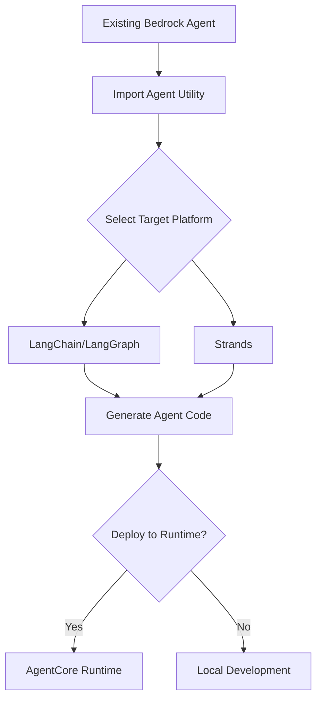

# Import Agent Overview

The `import-agent` utility enables you to migrate existing Amazon Bedrock Agents to Bedrock AgentCore, converting them into framework-specific implementations while leveraging AgentCore's enterprise-grade primitives.

> **Note**
> Use the output agent definition as a starting point for your custom agent implementation.
> Review the generated code, evaluate agent behavior, and make necessary changes before deploying.
> Extend the agent with additional tools, memory, and other features as required.

## What is Import Agent?

The import-agent utility automates the process of:

1. **Fetching** your existing Bedrock Agent configuration
2. **Converting** it to LangChain/LangGraph or Strands framework code
3. **Integrating** AgentCore primitives (Memory, Code Interpreter, Observability, Gateway)
4. **Deploying** to AgentCore Runtime (optional)

## Key Benefits

- **Framework Flexibility**: Convert to LangChain/LangGraph or Strands
- **Zero Infrastructure**: Leverage AgentCore's serverless platform
- **Enhanced Capabilities**: Add Memory, Code Interpreter, and Observability
- **Production Ready**: Deploy directly to AgentCore Runtime
- **Preserved Logic**: Maintains your agent's core functionality

## Supported Target Platforms

### LangChain + LangGraph
Perfect for teams already using the LangChain ecosystem or those looking for extensive third-party integrations.

### Strands
Ideal for teams wanting AWS-native agent development with streamlined patterns.

## Generated Output

The utility generates an agent implementation including:

- **Agent Code**: Framework-specific implementation of your Bedrock Agent
- **Dependencies**: All required packages and versions
- **Configuration**: Environment setup and deployment configuration
- **AgentCore Integration**: Memory, Code Interpreter, and Observability primitives

## Migration Workflow

## Next Steps

- [Quick Start Guide](quickstart.md) - Get started in 5 minutes
- [Configuration Reference](configuration.md) - Detailed parameter guide
- [Design Choices](design.md) - Details on the design of the generated agent
